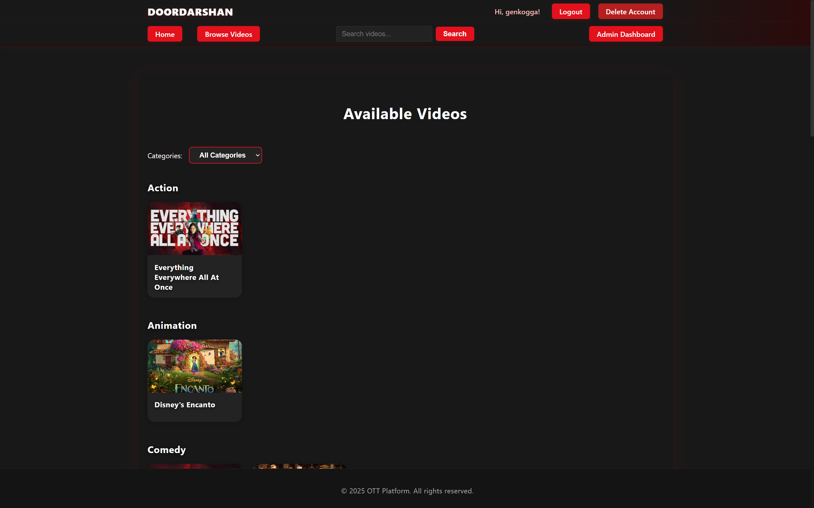
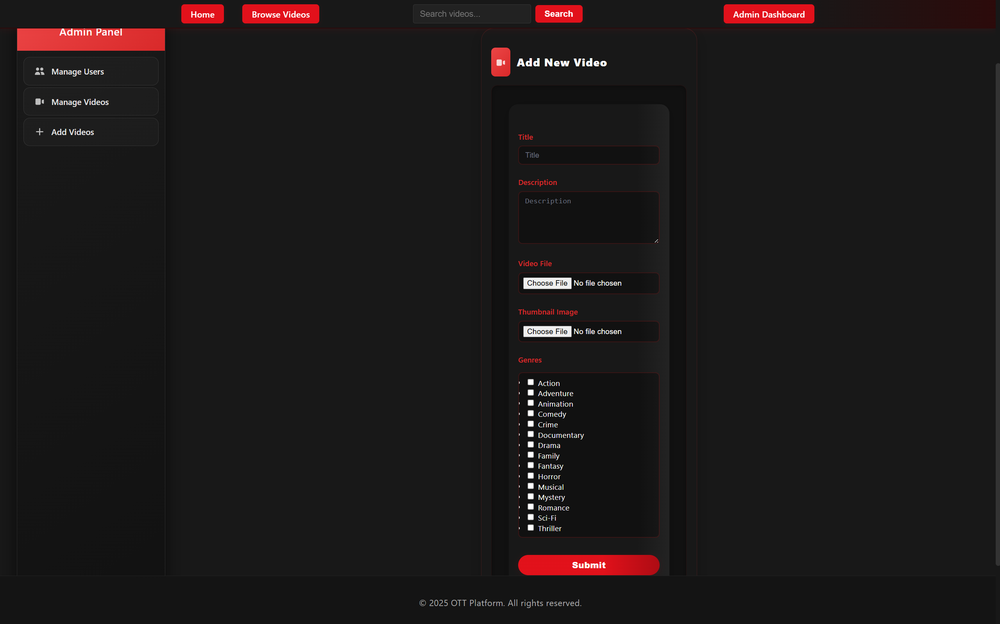

# DOORDARSHAN (OTT Platform)

DOORDARSHAN is a full-featured Over-The-Top (OTT) platform built with Flask and Python, designed to demonstrate the essential components of a modern streaming service. The platform supports user registration, authentication, role-based access control (admin and users), video upload and management, genre/category organization, search and discovery, and secure file handling with AWS S3 integration. It features a responsive UI with Jinja2 templates and includes email-based password reset functionality.

Key highlights:
- User registration, login, password reset, and account deletion
- Admin dashboard for user and video management
- Video upload, listing, search, and playback
- Genre and category management with seeding
- Secure file validation and S3 storage
- Exception handling for robust error management
- Modular codebase with clear separation of concerns (auth, admin, videos, utils, etc.)
- Linting, formatting, and testing support for maintainable development

Refer to the sections below for screenshots, project structure, setup instructions, and more details on features, modules, and exception handling.

---

## Table of Contents

- [Features](#features)
- [Screenshots](#screenshots)
- [Project Structure](#project-structure)
- [Key Modules](#key-modules)
- [Class and ER Diagrams](#class-and-er-diagrams)
- [Exception Handling](#exception-handling)
- [Setup Instructions](#setup-instructions)
- [Usage](#usage)
- [Linting & Formatting](#linting--formatting)
- [Testing](#testing)
- [Contribution](#contribution)
- [License](#license)

---

## Features

- User Registration & Login
- Role-Based Access Control (Admin, Users)
- Genre & Category Management
- Search & Discovery
- Video Player
- Admin Dashboard
- Admin - User Management (User Creation and Deletion)
- Admin - Videos Management (Add & Edit Options)
- Email Verification & Password Reset
- Delete Your Account

---

## Screenshots








---

## Project Structure

```
ott_platform/
├── app/
│   ├── __init__.py                     # App factory and initialization
│   ├── models.py                       # SQLAlchemy ORM models (User, Video, Genre, etc.)
│   ├── forms.py                        # Flask-WTF form classes for user and video forms
│   ├── extensions.py                   # Extensions (db, login_manager, etc.) initialization
│   ├── decorators.py                   # Custom decorators (e.g., admin_required)
│   ├── utils/
│   │   └── file_handling.py            # File upload, validation, and S3 utility functions
│   ├── admin/
│   │   ├── __init__.py
│   │   └── views.py                    # Admin routes: dashboard, user/video management
│   ├── auth/
│   │   ├── __init__.py
│   │   ├── views.py                    # Auth routes: register, login, logout, password reset, delete account
│   │   └── token.py                    # Token generation and verification for password reset
│   ├── videos/
│   │   ├── __init__.py
│   │   └── views.py                    # Video routes: upload, list, detail, search
│   ├── static/
│   │   ├── css/
│   │   │   └── main.css                # Main stylesheet
│   │   └── js/
│   │       └── main.js                 # Main JavaScript file
│   └── templates/
│       ├── _macros.html                # Shared Jinja2 macros for forms and tables
│       ├── base.html                   # Base template for all pages
│       ├── index.html                  # Home page
│       ├── admin/
│       │   ├── admin_dashboard.html    # Admin dashboard UI
│       │   └── edit_video_inline.html  # Inline video edit form for admin
│       ├── auth/
│       │   ├── login.html              # Login page
│       │   ├── register.html           # Registration page
│       │   ├── reset_password.html     # Password reset form
│       │   ├── reset_password_request.html # Request password reset form
│       │   └── delete_account.html     # Delete account confirmation page
│       ├── videos/
│       │   ├── list_content.html       # List/search videos page
│       │   ├── content_detail.html     # Video content detail page
│       │   ├── upload_content.html     # Video upload form
│       │   └── video_detail.html       # Video player/detail page
│       └── email/
│           ├── reset_password.html     # Password reset email template (HTML)
│           └── reset_password.txt      # Password reset email template (plain text)
├── config.py                           # App configuration (dev, prod, etc.)
├── requirements.txt                    # Python dependencies
├── run.py                              # App entry point
└── README.md                           # Project documentation
```

---

## Key Modules

- **User Registration & Login:**
  - `app/auth/views.py`, `app/forms.py`, `app/templates/auth/register.html`, `app/templates/auth/login.html`
- **Role-Based Access Control (Admin, Users):**
  - `app/models.py`, `app/admin/views.py`, `app/auth/views.py`
- **Genre & Category Management:**
  - `app/models.py`, `app/forms.py`
- **Search & Discovery:**
  - `app/videos/views.py`, `app/templates/videos/list_content.html`, `app/templates/base.html`
- **Video Player:**
  - `app/templates/videos/list_content.html`, `app/templates/videos/video_detail.html`
- **Admin Dashboard:**
  - `app/admin/views.py`, `app/templates/admin/admin_dashboard.html`
- **Admin - User Management (User Creation and Deletion):**
  - `app/admin/views.py`, `app/forms.py`, `app/templates/admin/admin_dashboard.html`
- **Admin - Videos Management (Add & Edit Options):**
  - `app/admin/views.py`, `app/forms.py`, `app/templates/admin/admin_dashboard.html`, `app/templates/admin/edit_video_inline.html`
- **Email Verification & Password Reset:**
  - `app/auth/views.py`, `app/token.py`, `app/forms.py`, `app/templates/auth/reset_password.html`, `app/templates/auth/reset_password_request.html`
- **Delete Your Account:**
  - `app/auth/views.py`, `app/forms.py`, `app/templates/auth/delete_account.html`

---

## Class and ER Diagrams

**Class Diagram**


**ER Diagram**


---

## Exception Handling

Exception handling is implemented throughout the application to ensure robust error management and a smooth user experience. Below is a summary of where and how exceptions are handled:

1. **Admin Video Management** (`app/admin/views.py`):
   - Handles exceptions in add/edit/delete video routes (file uploads, DB, S3). Flashes error and redirects to dashboard.
2. **Admin User Management** (`app/admin/views.py`):
   - Handles DB errors in user removal. Flashes error and redirects to dashboard.
3. **User Registration** (`app/auth/views.py`):
   - Handles duplicate/DB errors. Flashes error and redirects to registration.
4. **User Account Deletion** (`app/auth/views.py`):
   - Handles DB errors. Flashes error and redirects to account page.
5. **Video Content Upload** (`app/videos/views.py`):
   - Handles file/DB/S3 errors. Flashes error and redirects to upload page.
6. **File Handling Utility** (`app/utils/file_handling.py`):
   - Handles file/S3 errors. Raises error to be flashed by the caller.
7. **Password Reset Token Verification** (`app/models.py`):
   - Handles invalid/expired tokens. Returns None on failure.
8. **General DB Operations** (`app/models.py`, `app/videos/views.py`, `app/admin/views.py`):
   - Handles integrity/connection errors. Flashes error and redirects or shows error page.

**Summary**

| Location                                 | Why Exception Handling?                | How Handled?                                   |
|-------------------------------------------|----------------------------------------|------------------------------------------------|
| Admin video add/edit/delete               | File/DB errors, S3 issues              | Flash error, redirect to dashboard             |
| Admin user removal                        | DB errors                             | Flash error, redirect to dashboard             |
| User registration                         | Duplicate/DB errors                   | Flash error, redirect to registration          |
| User account deletion                     | DB errors                             | Flash error, redirect to account page          |
| Video content upload                      | File/DB/S3 errors                     | Flash error, redirect to upload page           |
| File handling utility                     | File/S3 errors                        | Raise error, flash in calling function         |
| Password reset token verification         | Invalid/expired token                 | Return None                                    |
| General DB operations                     | Integrity/connection errors           | Flash error, redirect or show error page       |

---

## Setup Instructions

1. **Clone the repository:**
    ```bash
    git clone <your-repo-url>
    cd doordarshan
    ```
2. **Create and activate a virtual environment:**
    ```bash
    python -m venv venv
    # On Windows:
    .\venv\Scripts\activate
    # On macOS/Linux:
    source venv/bin/activate
    ```
3. **Install dependencies:**
    ```bash
    pip install -r requirements.txt
    ```
4. **Set up AWS S3 for file storage:**
    1. **Create an AWS IAM User:**
        - Go to the [AWS IAM Console](https://console.aws.amazon.com/iam/).
        - Click **Users** > **Add users**.
        - Enter a username (e.g., `doordarshan-s3-user`).
        - Select **Programmatic access**.
        - Click **Next: Permissions**.
        - Attach the policy **AmazonS3FullAccess** (or create a custom policy with least privilege for your bucket).
        - Complete the steps and save the **Access Key ID** and **Secret Access Key**.
    2. **Create an S3 Bucket:**
        - Go to the [S3 Console](https://s3.console.aws.amazon.com/s3/).
        - Click **Create bucket**.
        - Enter a unique bucket name (e.g., `doordarshan-media`), select a region, and create the bucket.
        - (Optional) Set permissions and CORS as needed for your app.
        - **Set the Bucket Policy for Public Read Access:**
            - Go to your bucket > **Permissions** tab > **Bucket policy**.
            - Paste the following policy, replacing `doordarshan-media` with your actual bucket name:
                ```json
                {
                    "Version": "2012-10-17",
                    "Statement": [
                        {
                            "Sid": "PublicReadGetObject",
                            "Effect": "Allow",
                            "Principal": "*",
                            "Action": "s3:GetObject",
                            "Resource": "arn:aws:s3:::doordarshan-media/*"
                        }
                    ]
                }
                ```
            - This allows public read access to all objects in your bucket (for video streaming). Adjust as needed for your use case.
    3. **Configure AWS credentials locally:**
        - You can set credentials using environment variables, or run:
            ```bash
            aws configure
            ```
        - Enter your **Access Key ID**, **Secret Access Key**, and default region.
    4. **Update your `.env` file** with your AWS credentials and S3 bucket name (see `.env.example`).
5. **Configure environment variables:**
    - Copy `.env.example` to `.env` and update the variables as needed (e.g., secret key, database URI, mail settings, AWS credentials, S3 bucket name).
6. **Initialize and migrate the database:**
    ```bash
    flask db init
    flask db migrate -m "Initial migration"
    flask db upgrade
    ```
7. **Seed default genres:**
    ```bash
    flask seed-genres
    ```

8. **Create the first admin account:**
    - Open a terminal and start the Flask shell:
      ```bash
      flask shell
      ```
    - In the shell, execute:
      ```python
      from app.models import User
      from app import db
      admin_user = User(username='<your_username>', email='example@gmail.com', role='admin')
      admin_user.set_password('<your_secure_password>')
      db.session.add(admin_user)
      db.session.commit()
      print(f"Admin user '{admin_user.username}' created successfully!")
      exit()
      ```
    - Be sure to change the username, email, and password as needed.

9. **Run the application:**
    ```bash
    python run.py
    ```

---

## Usage

- Access the app at [http://localhost:5000](http://localhost:5000) after running `python run.py`.
- Register a new user or log in with existing credentials.
- Admin users can access `/admin` for dashboard and management features.
- Upload, browse, and search for video content.
- Reset password via email if needed.

---

## Linting & Formatting

- **Lint:**
    ```bash
    flake8 app/
    ```
- **Format:**
    ```bash
    black app/
    ```

---

## Testing

- **Run tests:**
    ```bash
    pytest
    ```

---

## Contribution

- Follow [PEP8](https://www.python.org/dev/peps/pep-0008/) and use `black` for formatting.
- Run `flake8` before submitting pull requests.
- Add or update tests for new features.
- Document new modules and functions.
- Open an issue or discussion for major changes before submitting a PR.

---

## License

This project is licensed under the [MIT License](LICENSE).

---